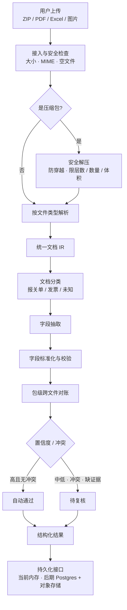
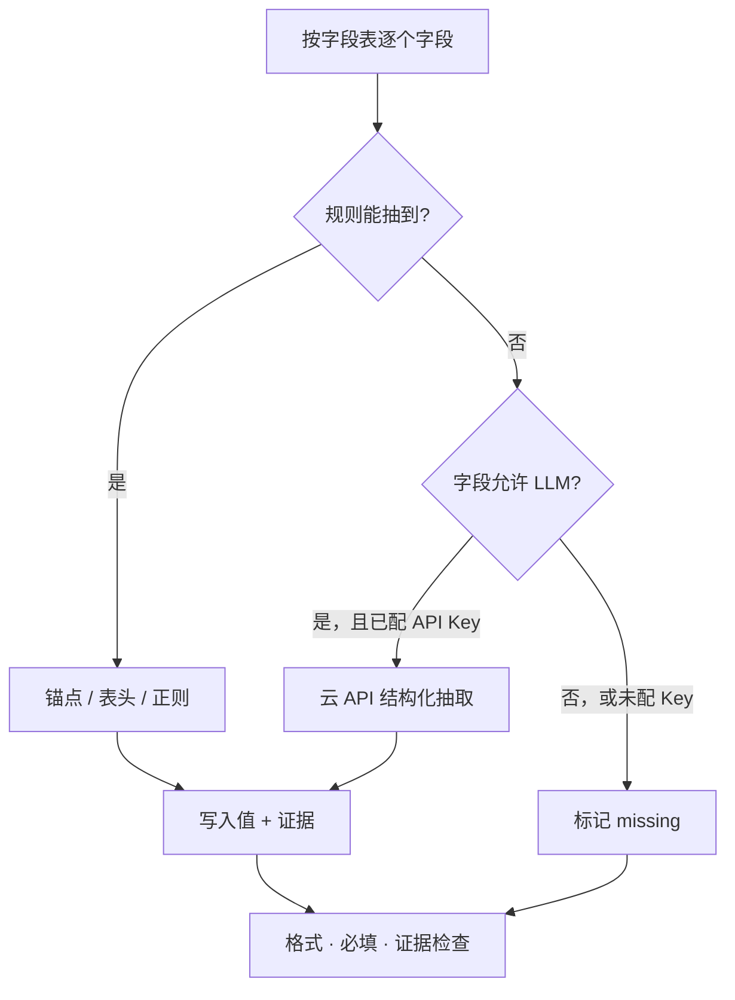
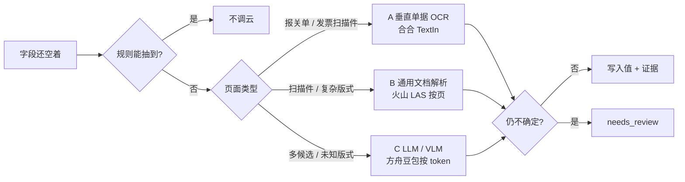

# DocParse

多格式单据解析骨架：用户上传压缩包 / PDF / Excel / 图片，流水线解析出报关单号等业务字段。

当前阶段是**框架层**。需求方尚未给出真实样本和字段清单，因此：

- 主链路是确定性流水线，不是 Agent，也不引入 LangChain / LangGraph
- 模型只通过云 API 调用，不部署本地大模型
- 持久化先不实现，接口和数据模型已预留，后续可换成 PostgreSQL + 对象存储

## 主链路

一份上传从接入走到结构化结果。压缩包先安全拆开，再和单文件走同一条解析链路。没有证据的字段不能自动通过。



彩色交互版见 [docs/flow.html](docs/flow.html)。

## 字段怎么抽

规则能抽到就不调模型。抽到的值必须带回原文证据。



云 API 再拆三层，不要横向比「哪个大模型最强」。选型与报价见 [docs/model-survey.md](docs/model-survey.md)。



## 模块地图

每个 parser 只做一件事：`bytes + filename → DocumentIR`。每个 pipeline step 只改 `PipelineContext`。

```mermaid
flowchart TB
    subgraph entry [入口]
        API[api/ FastAPI]
        CLI[cli.py]
    end

    subgraph pipe [固定流水线]
        P[pipeline/]
        S[pipeline/steps/<br/>ingest · unpack · extract<br/>classify · fields · validate<br/>reconcile · route_review]
        P --> S
    end

    subgraph core [稳定契约]
        DOM[domain/<br/>任务 · IR · 字段]
        SCH[schema/fields.yaml]
    end

    subgraph adapt [可替换适配器]
        PAR[parsers/<br/>ZIP · PDF · Excel · 图片]
        LLM[llm/ 云 API]
        JOB[jobs/ 任务存储]
        FIL[files/ 文件存储]
    end

    subgraph ext [抽取]
        EX[extraction/<br/>分类 · 抽字段 · 校验]
    end

    API --> P
    CLI --> P
    S --> PAR
    S --> EX
    EX --> SCH
    EX --> LLM
    PAR --> DOM
    EX --> DOM
    P --> JOB
    P --> FIL
```



| 流程图节点 | 实现位置 | 本阶段 |
|---|---|---|
| 接入与安全检查 | `pipeline/steps/ingest.py` | 骨架：大小 / 空文件 |
| 安全解压 | `adapters/parsers/unpack.py` | 骨架：zip 穿越 / 层数 / 体积 |
| 按文件类型解析 | `adapters/parsers/` | 文本可用；PDF/Excel 需可选依赖 |
| 统一文档 IR | `domain/ir.py` | 已定形状 |
| 文档分类 | `extraction/classify.py` | 关键词占位 |
| 字段抽取 | `extraction/fields.py` | 锚点规则 + LLM 接口 |
| 标准化与校验 | `extraction/validate.py` | 格式 / 必填 / 证据 |
| 包级对账 | `pipeline/steps/reconcile.py` | 同名字段冲突 |
| 自动通过 / 待复核 | `pipeline/steps/route_review.py` | 只打状态 |
| 持久化接口 | `adapters/jobs/` `adapters/files/` | 内存实现 |
| 云 LLM | `adapters/llm/openai_compat.py` | 未配 Key 则跳过 |

完整拆 Issue 顺序见 [docs/modules.md](docs/modules.md)。

## 快速开始

```bash
python3.11 -m venv .venv
source .venv/bin/activate
pip install -e ".[dev]"
cp .env.example .env

uvicorn docparse.api.app:app --reload --port 8088
```

健康检查：

```bash
curl http://127.0.0.1:8088/health
```

同步解析一份本地文件（不经过 HTTP）：

```bash
python -m docparse.cli parse path/to/file.zip
```

## 文档

- [流程图](docs/flow.html)（浏览器用 `file://` 打开本地文件）
- [设计文档](docs/design.md)
- [模块地图](docs/modules.md)（后期按模块拆 Issue）
- [云模型调研](docs/model-survey.md)（价格均附来源链接）
- [字段 Schema 占位](docs/field-schema.md)
- [持久化预留](docs/persistence.md)
- [开发规范](CLAUDE.md)

## 开发流程

```text
Issue → worktree（绑定该 Issue）→ 实现模块 → PR（Closes #）→ 合并
```

一个 Issue = 一个 worktree = 一个分支。不要在主仓库 `main` 上直接改功能。细节见 [CLAUDE.md](CLAUDE.md)。

## 仓库约定

- GitHub 个人账号：`Baldwinzc`
- 提交邮箱：`1018067278@qq.com`
