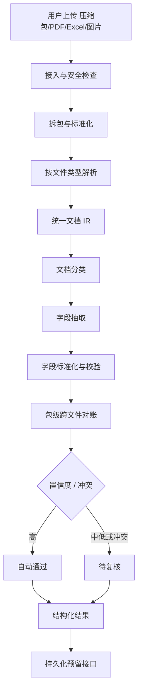
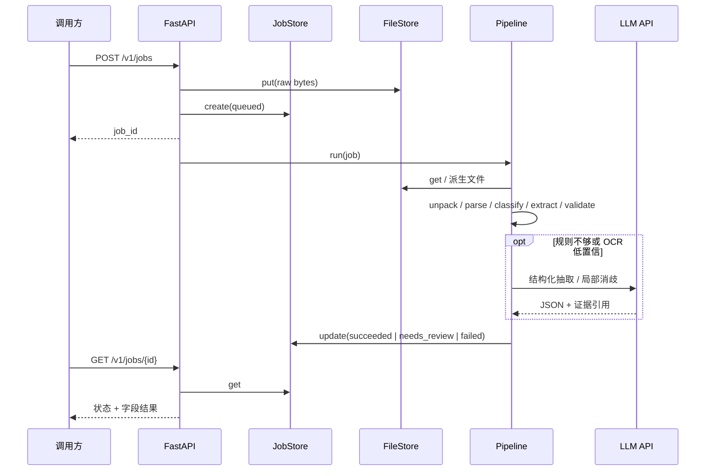

# DocParse 设计文档（框架阶段）

状态：草案。等需求方提供真实 case（PDF / 压缩包 / Excel）和目标字段后，再补抽取规则与评测集。

## 1. 目标与边界

### 要做

- 接收压缩包、PDF、Excel、图片
- 安全拆包、按类型解析、文档分类、字段抽取、规则校验
- 每个字段保留证据（文件、页码、单元格、坐标、原文摘录）
- 低置信度进入待复核，不强迫模型编造

### 明确不做（本阶段）

- 不做通用智能体，不引入 LangChain / LangGraph
- 不部署本地 LLM / VLM / OCR 大模型
- 不实现数据库和对象存储
- 不实现人工复核前端
- 不绑定具体报关单模板（字段表先占位）

## 2. 架构原则

1. **流水线，不是 Agent。** 步骤顺序写死，模型只作为某一步里的函数。
2. **规则优先，API 兜底。** Excel / 文本 PDF 先程序解析；扫描件和歧义字段再调云 API。
3. **统一中间表示（IR）。** 所有解析器输出同一套 `ParsedDocument`，后续步骤不关心原始格式。
4. **可替换适配器。** 任务存储、文件存储、LLM 客户端都走 Protocol，当前给内存实现。
5. **禁止无证据写入。** 字段没有 `evidence` 就不能自动通过。

## 3. 总体流程



异步任务视角：



## 4. 模块划分

```text
src/docparse/
  api/            HTTP 入口，同步/异步任务
  domain/         任务、文档 IR、字段、证据
  pipeline/       固定步骤编排
  adapters/
    files/        文件存储 Protocol（内存 / 预留 S3）
    jobs/         任务存储 Protocol（内存 / 预留 Postgres）
    llm/          云 API 客户端
    parsers/      ZIP / PDF / Excel / 图片
  extraction/     规则抽取 + LLM 抽取
  schema/         字段定义 YAML（待需求方确认）
```

主链路步骤（`pipeline/steps`）：

| 步骤 | 职责 | 是否调模型 |
|---|---|---|
| `ingest` | 记录原始文件、校验大小和 MIME | 否 |
| `unpack` | 安全解压，限制层数/数量/体积 | 否 |
| `extract` | 按类型解析为 IR | 否（OCR 后续可插） |
| `classify` | 报关单 / 发票 / 未知 | 规则优先，不够再调 LLM |
| `extract_fields` | 按字段表抽取 | 规则优先，歧义调 LLM |
| `validate` | 格式、必填、计算 | 否 |
| `reconcile` | 同一压缩包跨文件对齐 | 解释可调 LLM，改值不允许 |
| `route_review` | 按置信度和冲突分流 | 否 |

## 5. 模型调用（本阶段：只走 API）

配置见 `.env.example`。客户端按 OpenAI 兼容协议封装，便于换供应商。

调用纪律：

- 只传局部文本或局部截图，不把整个压缩包塞进上下文
- 必须带 JSON Schema；找不到返回 `null`
- 每个值必须回指 IR 中的 `block_id` / 单元格
- 模型输出必须再过规则校验，不能直接入库

后续若改为本地部署，只换 `adapters/llm` 实现，流水线不动。

## 6. 安全解压

压缩包是第一道风险面，框架里先落地守卫：

- 按内容判断类型，不只信扩展名
- 拒绝路径穿越（`..`、绝对路径）
- 限制递归层数、文件数、解压后体积、压缩比
- 加密包标记为需要密码，不盲解
- 原文件只读，派生文件另存

## 7. 与 Agent / LangGraph 的关系

主流程是 DAG。只有未知版式、跨文件冲突解释、人工追问这三类问题，以后才考虑加一个权限收窄的 `ExceptionAgent`。即便那时，也优先自研状态机或 LangGraph 只编排异常环，不把 LangChain 当业务骨架。

## 8. 待需求方补充后才能定的部分

1. 文档类型清单（是否含发票、装箱单、提单、合同）
2. 字段定义、是否必填、校验规则
3. 脱敏样本和模板种类
4. 日均量和是否允许数据出网（当前假设允许走 API）
5. 可接受的人工复核比例和时延
